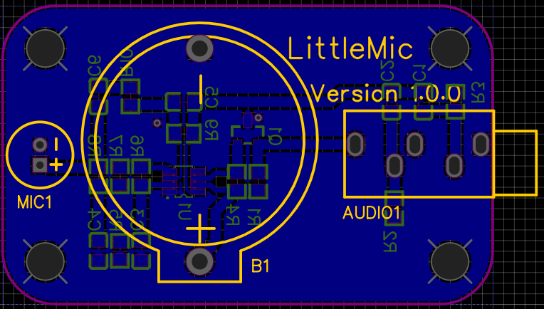

# LittleMic

Little battery powered microphone with a 3.5 mm audio jack. Goes into a lower power sleep mode when the audio jack is disconnected. Uses the [MAX4467](https://datasheets.maximintegrated.com/en/ds/MAX4465-MAX4469.pdf) IC. Designed in [EasyEDA](https://easyeda.com/).

## Licence

Copyright © 2020, 2021 Phil Baldwin

This work is licensed under a Creative Commons Attribution-ShareAlike 4.0 International License.

You should have received a copy of the license along with this work. If not, see <http://creativecommons.org/licenses/by-sa/4.0/>.
